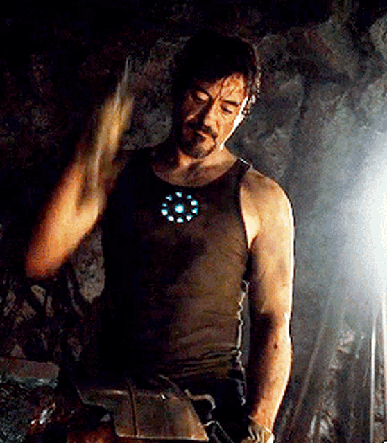

  

<h1 align="center">Hello &nbsp; , I'm Harsh Singh</h1>

  

  💻 Full-Stack Developer | ⚡ Problem Solver | 🚀 Cloud & Distributed Systems Enthusiast

  <h2>🌐 Connect with Me</h2>
  
Let's connect, collaborate, and build something extraordinary!

  

    
    &nbsp;
    
    &nbsp;
    
    &nbsp;
    
    &nbsp;
    
  

  

    
  

 

<h2 align="center">🚀 About Me</h2>

I'm a <b>Full-Stack Software Engineer</b> and Computer Science student at <b>Rajasthan Technical University, Kota</b> (GPA: 9.60). I have hands-on experience building production-grade, highly scalable distributed web applications with <b>Go, TypeScript, React, Node.js, Express, AWS Lambda, DynamoDB, and GraphQL</b>.

- 💼 **Experience**: Software Engineer Intern at **Icoinage Soft Labs** (MedSahi SaaS) & former Node.js Intern at **Celebal Technologies**.
- 🏆 **DSA / Competitive Programming**: Solved **900+ DSA problems** across LeetCode, GFG, and CodeStudio. Global Rank **396** in LeetCode Biweekly Contest 153.
- 🎯 **Leadership**: President of **RTU Coders**, leading technical workshops, hackathons, and coding initiatives.
- 🛠️ **System & Architecture**: Strong grasp of Data Structures, Algorithms, OOP, Microservices, Serverless, Authentication/Authorization, and Payment Systems.

 

---

<h1 align="center"> Technical Skills & Toolkit</h1>

### 💻 Languages

  

### 🌐 Frontend Development

  

### ⚙️ Backend & APIs

  

### 🗄️ Databases & Caching

  

### ☁️ Cloud, DevOps & Tools

  

 

---

<h2 align="center">💼 Experience & Work History</h2>

<table style="width:100%; border-radius: 12px; border-collapse: collapse;">
  <tr>
    <th align="left" style="padding: 12px; background-color: #1e293b; color: #38bdf8;">Role & Company</th>
    <th align="left" style="padding: 12px; background-color: #1e293b; color: #38bdf8;">Timeline</th>
    <th align="left" style="padding: 12px; background-color: #1e293b; color: #38bdf8;">Key Contributions & Impact</th>
  </tr>
  <tr>
    <td valign="top" style="padding: 12px;">
      <b>Software Engineer Intern</b> 
      <i>Icoinage Soft Labs</i>
    </td>
    <td valign="top" style="padding: 12px;">Jan 2026 – Present</td>
    <td valign="top" style="padding: 12px;">
      • Built full-stack features on <b>MedSahi</b>, a multi-portal healthcare SaaS (patient, provider, support) using <b>React, TypeScript, Go, AWS Lambda, DynamoDB, GraphQL/AppSync</b>. 
      • Integrated <b>Razorpay ePay & wallet-based split payments</b> in Provider Portal, unifying multi-mode checkout. 
      • Designed & shipped <b>Guest Mode</b> for provider dashboards: OTP sessions, 4-step walk-in booking UI, and dedicated Go Lambda backend APIs. 
      • Engineered <b>Aadhaar Offline QR verification end-to-end</b> (Camera/Upload UI, Go Lambda decoder/signature/expiry validation).
    </td>
  </tr>
  <tr>
    <td valign="top" style="padding: 12px;">
      <b>Node.js Intern</b> 
      <i>Celebal Technologies</i>
    </td>
    <td valign="top" style="padding: 12px;">June 2025 – Aug 2025</td>
    <td valign="top" style="padding: 12px;">
      • Developed and maintained high-performance RESTful APIs using <b>Node.js</b> and <b>Express.js</b>. 
      • Designed MongoDB schemas, indexing strategies, and optimized queries for heavy workloads. 
      • Implemented JWT authentication, RBAC authorization mechanisms, and worked within Agile sprints.
    </td>
  </tr>
</table>

 

---

<h2 align="center">💡 Featured Projects</h2>

<table style="width:100%;">
  <tr>
    <td align="center" width="50%" valign="top">
      
        
      <h3>📄 DocSync – Real-Time Collaborative Editor</h3>
      

        A real-time document editor engineered similarly to Google Docs. Supports live co-authoring, presence detection, and debounced conflict-free synchronization.
      

      

        <b>Tech Stack:</b> <code>React.js</code>, <code>Node.js</code>, <code>Socket.io</code>, <code>Firebase Auth</code>, <code>Cloud Firestore</code> 
        • Real-time synchronization via WebSocket & Socket.io. 
        • Email-based sharing, granular access control (Viewer/Editor), debounced auto-save.
      

      <a href="https://github.com/h4rshgithub"><b>View on GitHub →</b></a>
    </td>
    <td align="center" width="50%" valign="top">
      
        
      <h3>🌍 WanderLust – Travel Listing Platform</h3>
      

        Full-stack vacation rental and travel listing web platform with end-to-end CRUD operations, interactive map integration, and persistent reviews.
      

      

        <b>Tech Stack:</b> <code>Node.js</code>, <code>Express.js</code>, <code>MongoDB</code>, <code>Bootstrap</code>, <code>HTML/CSS</code> 
        • Complete CRUD operations with persistent database storage. 
        • Responsive and intuitive UI with user authentication, reviews, and booking flows.
      

      <a href="https://github.com/h4rshgithub"><b>View on GitHub →</b></a>
    </td>
  </tr>
  <tr>
    <td align="center" width="50%" valign="top">
      
        
      <h3>🏥 MedSahi – Healthcare SaaS Portal</h3>
      

        Multi-portal healthcare platform powering patients, doctors, and support teams with instant booking, guest walk-ins, and Aadhaar-based KYC verification.
      

      

        <b>Tech Stack:</b> <code>React</code>, <code>TypeScript</code>, <code>Go</code>, <code>AWS Lambda</code>, <code>DynamoDB</code>, <code>AppSync</code> 
        • Serverless microservices architecture on AWS. 
        • Aadhaar QR offline cryptographic verification & Razorpay split payments.
      

    </td>
    <td align="center" width="50%" valign="top">
      
        
      <h3>⚡ What's Next?</h3>
      

        Continuously building microservices, cloud-native applications, and exploring high-scale distributed systems!
      

       
      
<b>Interested in collaborating or hiring?</b>

      <a href="mailto:harshsingh63864@gmail.com"><b>Get in touch ✉️</b></a>
    </td>
  </tr>
</table>

 

---

<h2 align="center">🏆 Achievements & Certifications</h2>

<table style="width:100%;">
  <tr>
    <td width="50%" valign="top">
      <h3>🌟 Key Achievements</h3>
      <ul>
        <li>🧩 <b>Solved 900+ DSA Problems</b> across LeetCode, GeeksforGeeks, and Coding Ninjas (CodeStudio).</li>
        <li>🏅 <b>Ranked 396 Globally</b> in LeetCode Biweekly Contest 153.</li>
        <li>👑 <b>President @ RTU Coders</b> — Leading college developer community, mentoring juniors & driving technical events.</li>
        <li>🎓 <b>Academic Excellence</b>: 9.60 GPA in B.Tech Computer Science & Engineering (Rajasthan Technical University).</li>
      </ul>
    </td>
    <td width="50%" valign="top">
      <h3>📜 Certifications</h3>
      <ul>
        <li>🎖️ <b>Problem Solving (Intermediate)</b> – HackerRank (Oct 2024)</li>
        <li>🎖️ <b>Java Certification</b> – HackerRank (Mar 2023)</li>
      </ul>
       
      

        
        &nbsp;&nbsp;
        
      

    </td>
  </tr>
</table>

 

---

<h2 align="center">📊 GitHub & Competitive Coding Stats</h2>

  
    
  
  

    

  <table>
    <tr>
      <td>
        
      </td>
      <td>
        
      </td>
    </tr>
  </table>

   

  <h3>🧩 LeetCode Stats</h3>
  

    
  

   

  <h3>GitHub Contribution Chart</h3>
  

    

  

    
🏆 GitHub Profile Trophy (Click to expand)

     
    
  

 

---

<h2 align="center">📫 Let's Connect!</h2>

<table align="center">
  <thead>
    <tr>
      <th align="center">📧 Email</th>
      <th align="center">💬 WhatsApp</th>
      <th align="center">💼 LinkedIn</th>
      <th align="center">🐙 GitHub</th>
    </tr>
  </thead>
  <tbody>
    <tr>
      <td align="center">
        <a href="mailto:harshsingh63864@gmail.com" target="_blank">
          
           
          <b>harshsingh63864@gmail.com</b>
        </a>
      </td>
      <td align="center">
        <a href="https://wa.me/916386449823" target="_blank">
          
           
          <b>+91 6386449823</b>
        </a>
      </td>
      <td align="center">
        <a href="https://www.linkedin.com/in/harshsingh2005" target="_blank">
          
           
          <b>harshsingh2005</b>
        </a>
      </td>
      <td align="center">
        <a href="https://github.com/h4rshgithub" target="_blank">
          
           
          <b>h4rshgithub</b>
        </a>
      </td>
    </tr>
  </tbody>
</table>

 

  <h3>
    ⭐️ From <a href="https://github.com/h4rshgithub">Harsh Singh</a> | Let's innovate together! 
  </h3>

